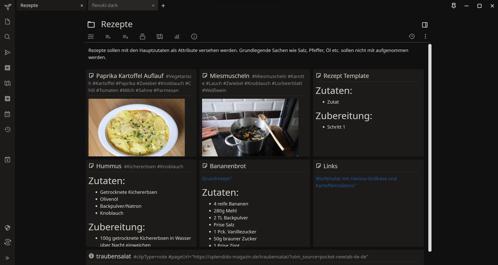
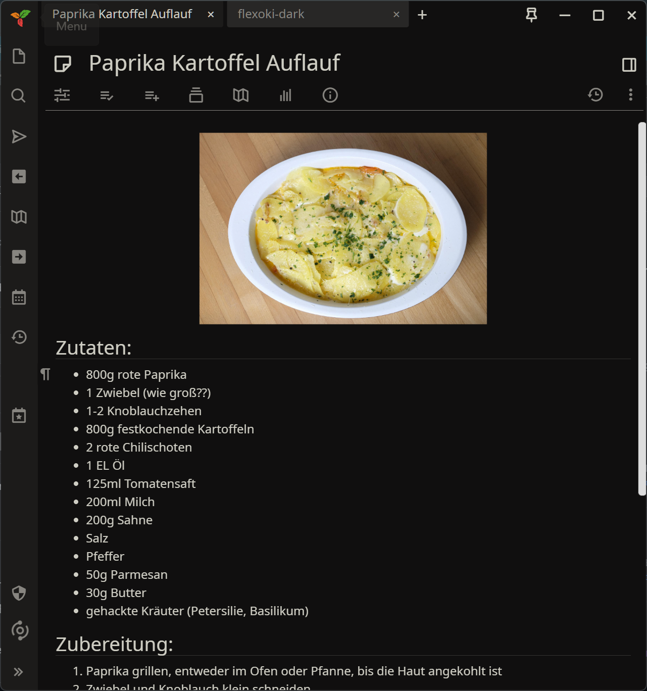
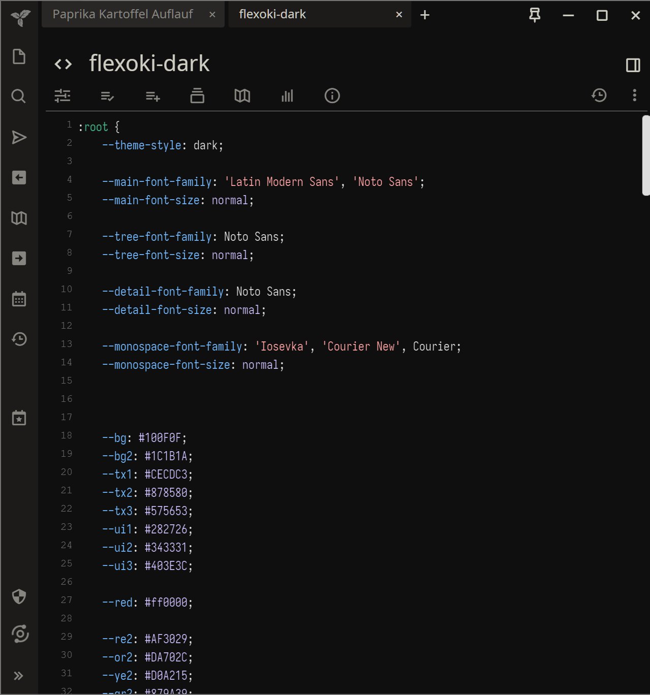

# trilium_flexoki
Flexoki Theme for Trilium!
Based on the [color scheme by Steph Ango](https://stephango.com/flexoki) and the great [Trilium VS Code Dark Theme.](https://github.com/greengeek/trilium-vscode-dark-theme)

 

## Usage
- Create a CSS code note in Trilium and name it flexoki-dark
- Paste the content from flexoki-dark.css in it
- Add the #appTheme=flexoki-dark attribute to it
- Go to Menu > Options, and select flexoki-dark as your new theme
- Ctrl + R to reload

## Font
The font used for code notes is [Iosevka](https://github.com/be5invis/Iosevka). 

